# 🧪 Azure AD B2C テナントを構成する

このチャプターでは、コンシューマーユーザー向けの認証基盤である Azure AD B2C テナントを作成し、認証に必要な設定を構成します。

1. B2C のリソースの作成
1. アプリを構成
1. ユーザーフローの作成
1. B2C でメモしておく情報を確認

## 1. B2C のリソースの作成

Azure ポータルで Azure AD B2C のテナントを作成します。

Azure ポータルで左上の「リソースの作成」をクリック (①) →検索で「b2c」と入力 (②) →「Azure Active Directory B2C」をクリックします (③)。

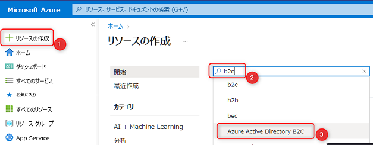

 

「Azure Active Directory B2C」をクリックします。

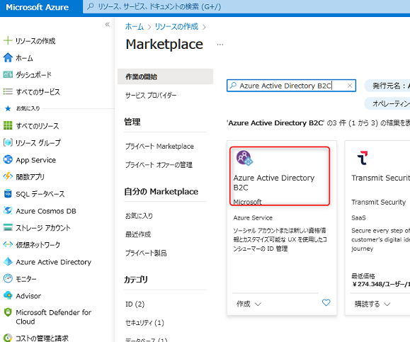

 

「作成」をクリックします。

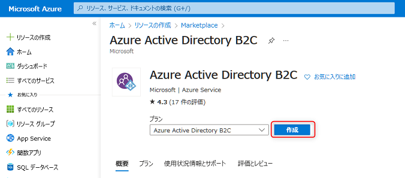

 

「新しい Azure AD B2C テナントを作成する」をクリックします。

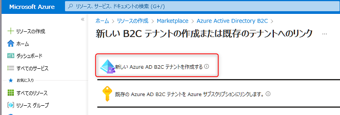

 

以下を参考にB2C テナントの情報を入力します。

- **組織名** (①): 任意の組織名を入力します。B2C テナントを開いたときに Azure ポータルの右上に表示されます。
- **初期ドメイン** (②): 任意のドメインを入力します。グローバルでユニークになる必要があります。
- **場所 (③)**: 日本を選びます。
- **サブスクリプション** (④): 任意のサブスクリプションを選択します。
- **リソースグループ**: 「新規作成」をクリックし (⑤)、任意のリソースグループ名を入力します。以降、このリソースグループにリソースを作成します。
- **リソースグループの場所**: 「Japan East」を選びます (⑥)。
- 入力が完了したら「確認及び作成」をクリックします (⑦) 。

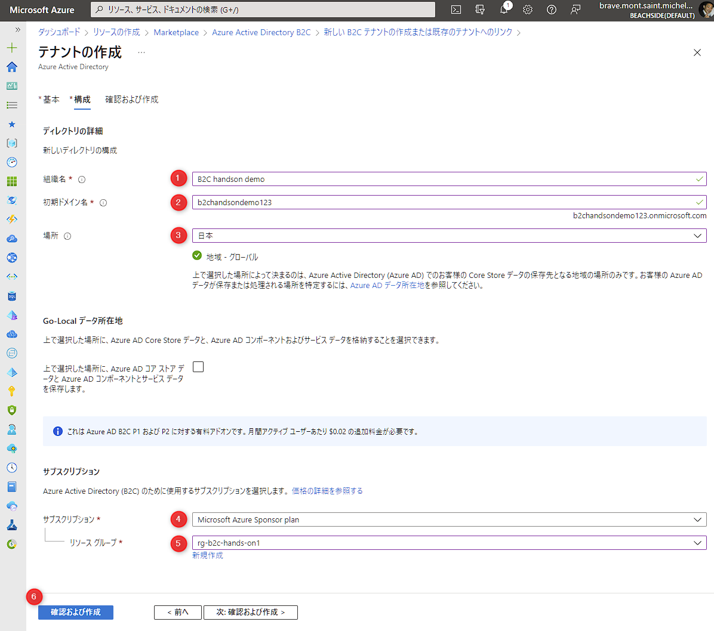

 

検証に成功したことを確認し、「作成」をクリックします。

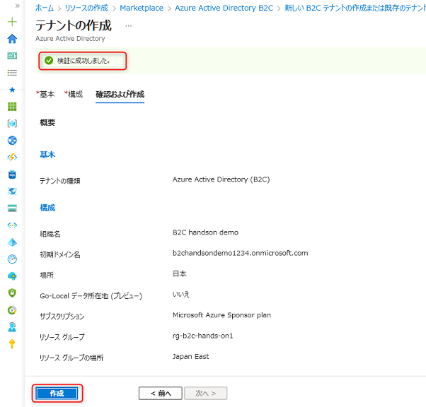

 

B2C テナントの作成が完了したら、リソースグループを開き B2C テナントをクリックします。

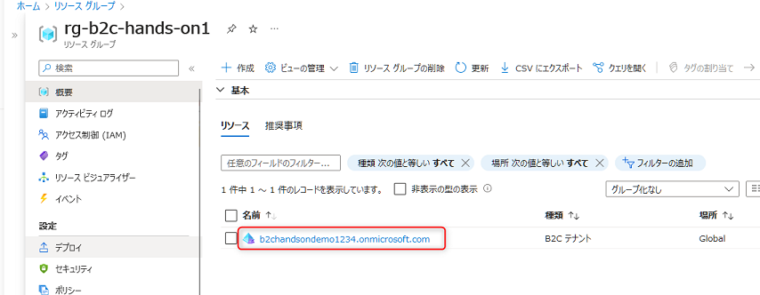

 

Azure ポータル右上に表示されている現在開いているテナント名に注意します。「Open B2C tenant」をクリックすし、B2C テナントへ移動します。

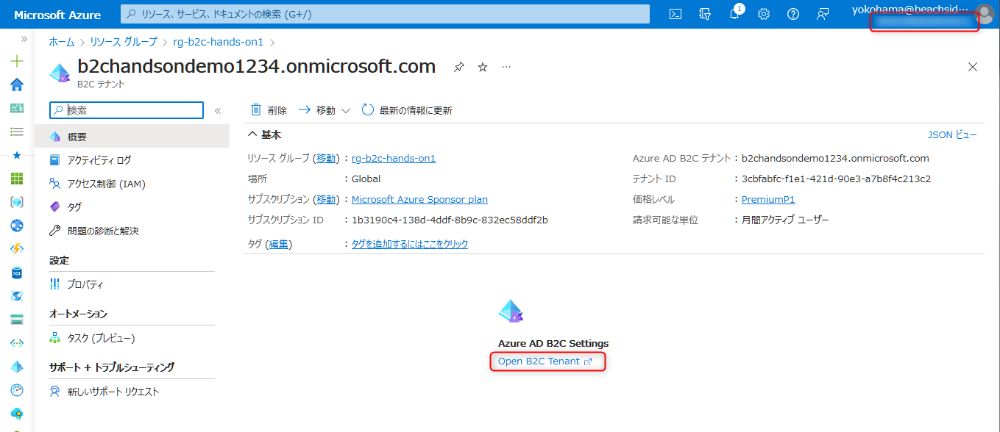

 

別タブでテナントが切り替わり B2C テナントが表示されます。Azure ポータルの右上も B2C のテナント名が表示されています。

 

## 2. アプリを構成

先述で作成した B2C テナントで、フロントエンドのアプリの認証に必要な設定をしていきます。

### 2-1. アプリの登録

「アプリの登録」をクリック (①) → 「新規登録」をクリック (②) します。

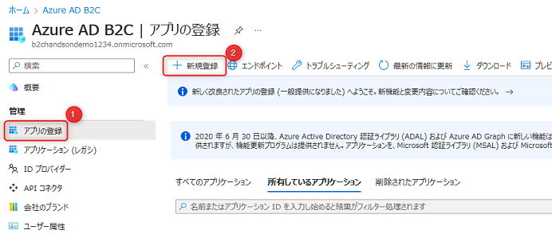

 

以下を参考に入力します。

- **名前** (①): 任意の名前を入力します。
- **サポートされているアカウントの種類** (②): 図にあるように一番下を選択します。
- **アクセス許可** (③): チェックを付けます。
- 入力が完了したら「登録」をクリック (③)します。

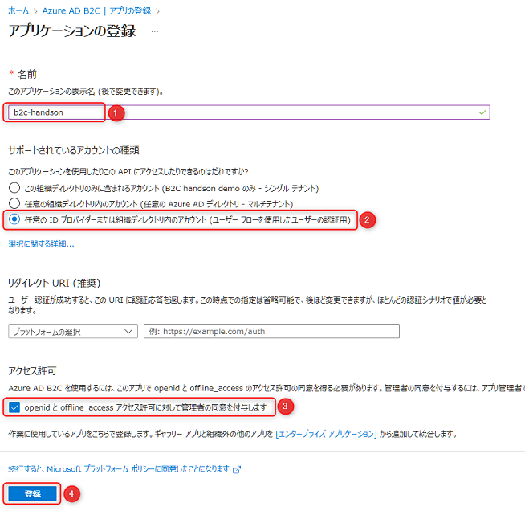

 

### 2-2. クライアントシークレットの作成

登録したアプリが表示されますので、「証明書とシークレット」をクリック (①) → 「新しいクライアントシークレット」をクリック (②) します。

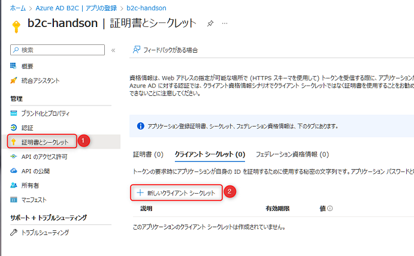

 

「クライアントシークレットの追加」ブレードが表示されます。説明を任意に入力して「追加」をクリックします。

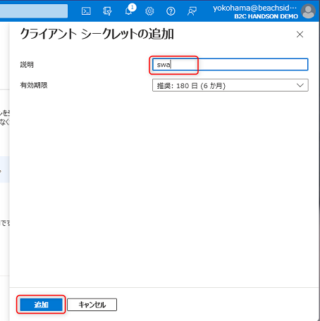

 

作成したシークレットの値が表示されますので、コピーのボタンをクリック (下図赤枠) してメモしておきます。以降表示されないので注意してください。後ほど利用します。

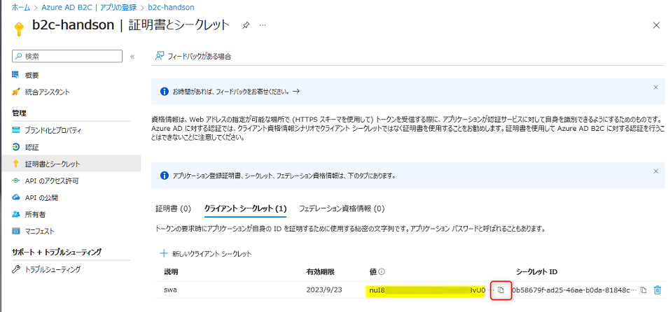

 

### 2-3. アプリの情報をメモ

フロントエンドで利用する B2C の情報を任意の場所にメモしておきます。必要な情報は、以下の2つです。

- **シークレット**: 先述の操作でコピーした値。
- **クライアント ID**: アプリの「概要」をクリック (①) すると、「アプリケーション (クライアント) ID」が表示されます。この値です。
  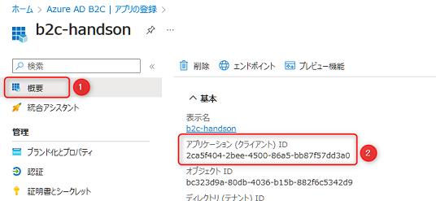

 

## 3. ユーザーフローの作成

サインイン / サインアップに使うユーザーフローを定義します。

Azure ポータルは「アプリの登録」が開かれているので、下図の赤枠の部分をクリックして B2C のメニューに戻ります。

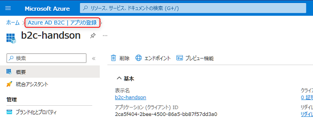

 

B2C のメニューで「ユーザーフロー」をクリック (①) → 「新しいユーザーフロー」をクリック (②) します。

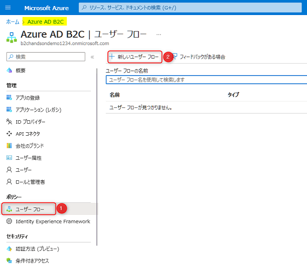

 

「ユーザーフローのタイプを選択する」で「サインアップとサインイン」を選択 (①) → 「バージョン」は「推奨」を選択 (②) → 「作成」をクリック (②)します。

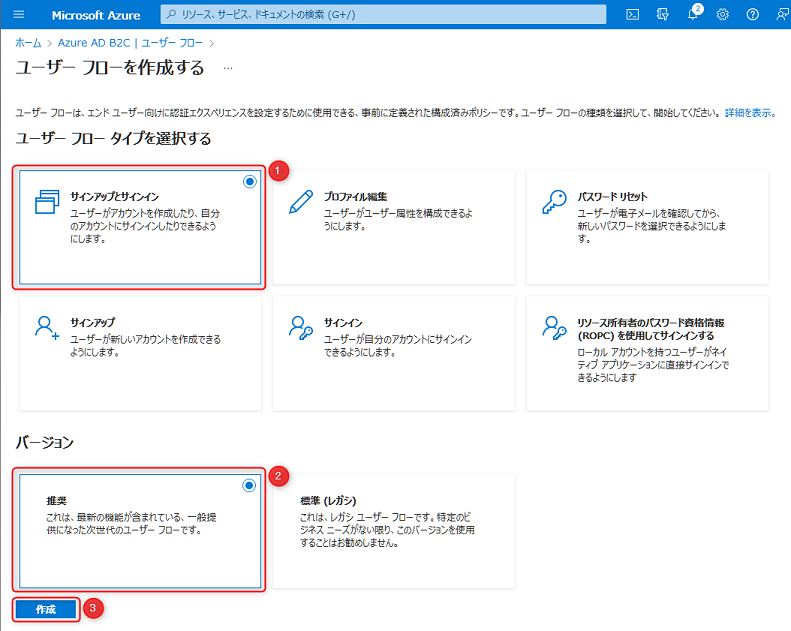

 

作成の画面が表示されますので、以下を参考に入力します。

- **名前**: 「susi」と入力します (①)。
- **ローカルアカウント**: 「Email signup」にチェックを入れます。
- **詳細を表示** をクリックします。

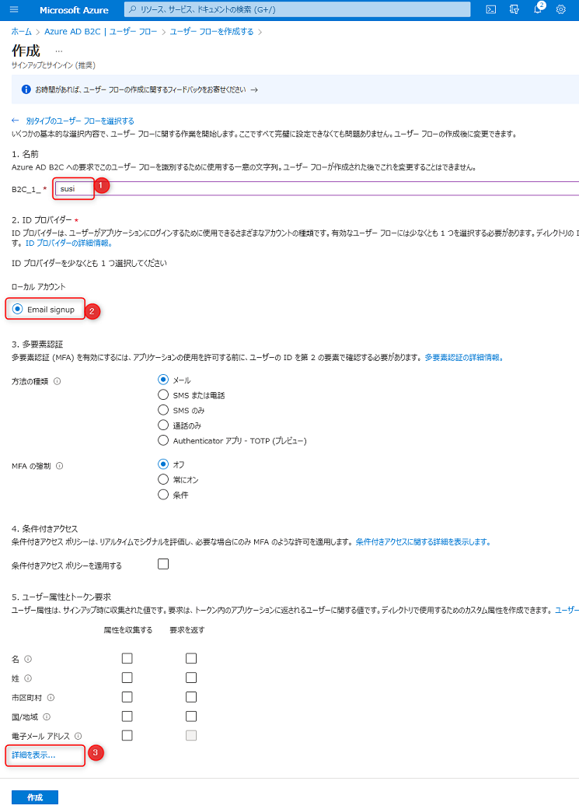

 

**詳細を表示** をクリックし、以下図のように「表示名」の二箇所にチェックを入れて「OK」をクリックします。

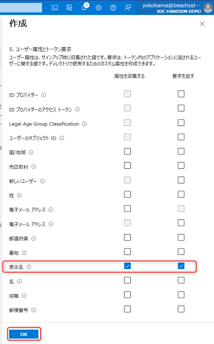

 

作成の画面に戻り、画面下部の「作成」をクリックして作成します。作成すると、ユーザーフローが表示されますのでクリックします。

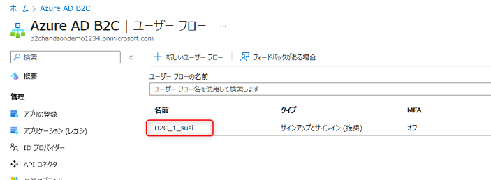

 

「ユーザーフローを実行します」をクリック (①) すると、右側に URL が表示 (②) されます 。この "wellKnownOpenIdConfiguration" の URL の値をメモしておきます。

 

## 4. B2C でメモしておく情報を確認

フロントエンドの認証を構成する際に必要な情報は、 2-3. アプリの情報をメモ「2-3. アプリの情報をメモ」の2つと、「3. ユーザーフローの作成」でメモした以下3つになります。

- アプリのシークレット
- アプリのクライアント ID
- wellKnownOpenIdConfiguration の URL

## ✨ Congratulations ✨

おめでとうございます 🎉 ここでは B2C テナントを作成し、認証で必要な設定を構成しました。

次のチャプターでは、json ファイルを構成するだけで静的サイトに認証を組み込みます。

----

[⏮️ 前へ](./setup-static-web-apps.md) | [📋 目次](./README.md) | [⏭️ 次へ](./setup-auth.md)
